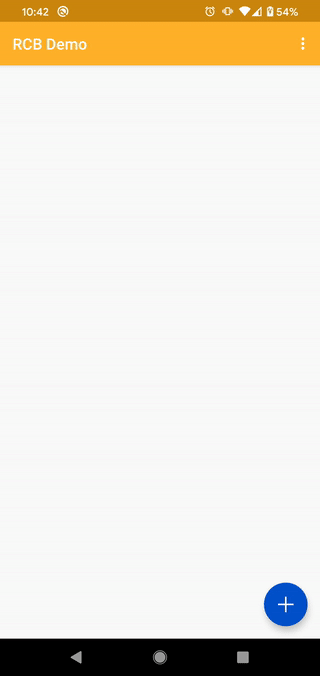
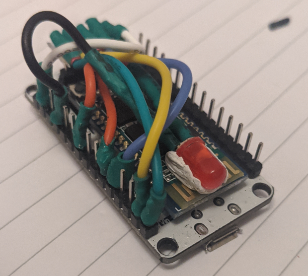
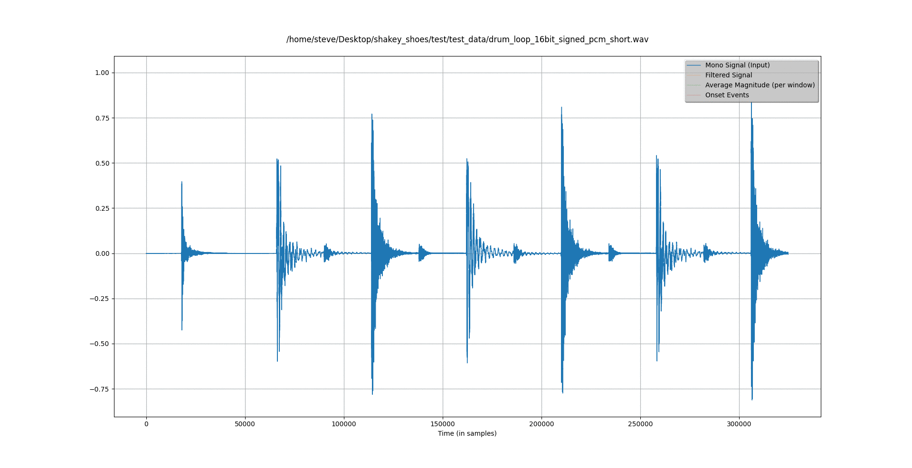

What is it?
-----------
A hardware/software project that vibrates wireless devices (aka, a pair of shoes) in time to the music being listened to by the user. 
The end result is that it feels like you're standing next to a giant, loud speaker. Why not?

The prototype almost ready. It has required huge amounts of research, experimentation, and trial & error.  
My first goal since the beginning was "just get something working", and I'm almost there.  

Components
----------
### Android

[main_app](android/main_app): __Working__  
The main Android app that connects to the hardware and controls the full system  

[audio_test](android/audio_test/samples/hello-oboe) : __WIP (temporary project)__  
Heavily modified Oboe sample to play low latency audio and call [fingerband](common/libfingerband)  

### Arduino

[circular_buffer](common/circular_buffer): __Working__  
A platform agnostic class implementing a circular buffer and input/output signals  

[arduino_app](arduino/arduino_app) : __Working__  
A small wrapper around [circular_buffer](common/circular_buffer) for the Arduino platform  

[mock_app](arduino/mock_app): __Working__  
A small wrapper around [circular_buffer](common/circular_buffer) for the Desktop platform  

[hardware](arduino/hardware): __Working__  
The hardware that runs [arduino_app](arduino/arduino_app)  

### Audio Analysis

[fingerband](common/libfingerband) : __Working__  
The audio processing library, responsible for calculating bass in the audio input  

[debug_viewer](test/debug_viewer): __Working__  
Parses and visualises debug logs from [fingerband](common/libfingerband)  

[test_runner](test/test_runner): __Working__  
Runs [fingerband](common/libfingerband) on Android and Desktop, comparing the outputs for equality  

Next Steps
----------
The next step is to combine the two Android apps (bringing the [audio_test](android/audio_test/samples/hello-oboe) app into the [main_app](android/main_app)). They each solve half the puzzle, so together I should have my very first v1 prototype, end-to-end fully working. Then:

- Take what I ended up with and strip away anything that's redundant from all components
- Focus on each component; refactoring, tidying, adding tests
- Release
- Start improving to the audio analysis for better bass detection
- Start improving the synronisation between what the user hears and feels at the same time
