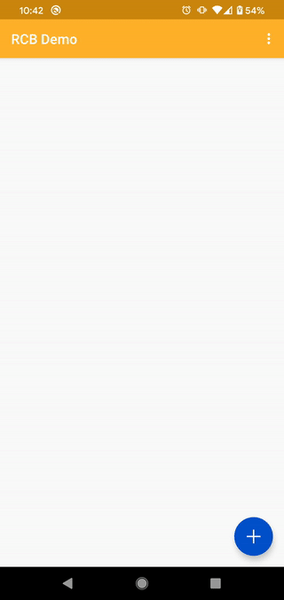

### Android

This the main app for the project where all the work will eventually be collated. It connects to the Arduino, configures the remote buffer and begins synchronising the vibration data.

- Kotlin/C++/JNI using Android Studio
- Plays audio at low latency while calling [fingerband](https://github.com/slambang/shakey_shoes/tree/master/common/libfingerband/libfingerband) for audio analysis
- Connects to Arduino via Bluetooth to transmit audio analysis results
