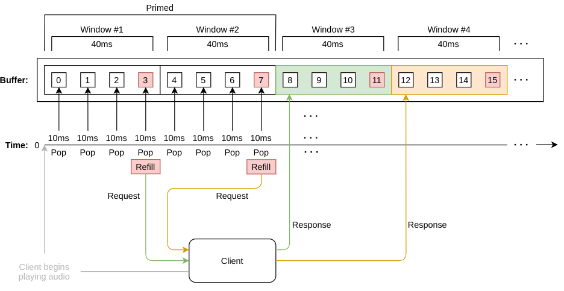

 The Arduino essentially acts a remote circular buffer, consuming items at regular intervals. This app implements the buffer in a platform agnostic way, and communicates with a client to keep the buffer full. It has been designed to run on a single thread, mimicking the Arduino platform. Each buffer item represents a vibration intensity which is felt in time with the music also being played on the client.

- The lifecycle begins by __priming__ (prefilling) the buffer with a number of windows
- As the music begins on the client, the circular buffer app also begins consuming items at regular intervals
- As soon as a full window has been consumed the app requests a refill from the client
- The client sends the next window data to the app, whcih is written to the end of the buffer
- All dimensions are configurable:
	- Window size
	- Number of windows to prime
	- Consume interval

- C/C++ using CLion
- Used by [arduino_app](https://github.com/slambang/shakey_shoes/tree/master/arduino/arduino_app) (target platform)
- Used by [mock_app](https://github.com/slambang/shakey_shoes/tree/master/arduino/mock_app) (development and testing platform)
