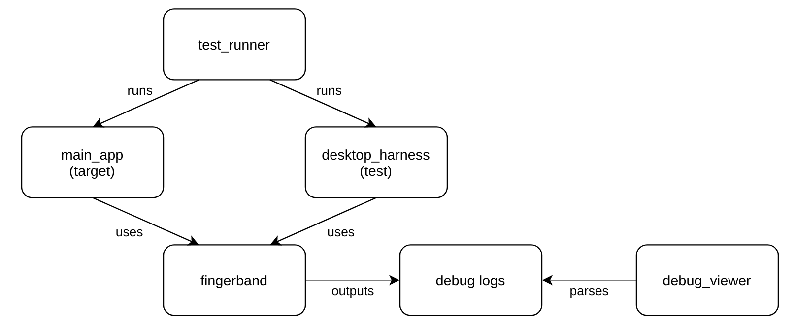

 In order to test [fingerband](https://github.com/slambang/shakey_shoes/tree/master/common/libfingerband/libfingerband) is working correctly on both Android (target platform) and Desktop (testing platform), I wrote this set of scripts. They invoke fingerband on both platforms, pull the debug logs into a central place and compares them for equality.

- Bash scripts
- Both sets of debug logs can be visualised with [debug_viewer](https://github.com/slambang/shakey_shoes/tree/master/test/debug_viewer)
